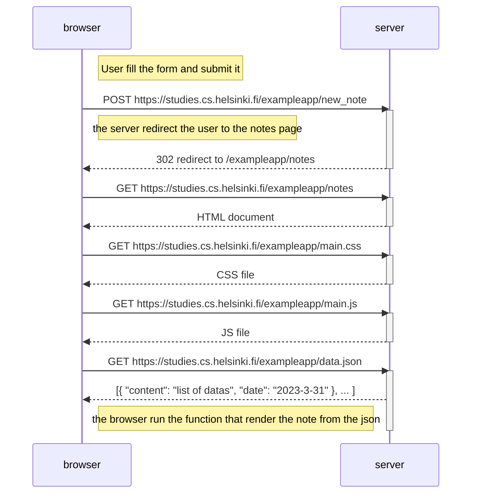

```mermaid
sequenceDiagram
    participant browser
    participant server

    Note right of browser: User fill the form and submit it
    browser->>server: POST https://studies.cs.helsinki.fi/exampleapp/new_note
    activate server
Note right of browser: the server redirect the user to the notes page
    server-->>browser: 302 redirect to /exampleapp/notes
    deactivate server

    browser->>server: GET https://studies.cs.helsinki.fi/exampleapp/notes
    activate server
    server-->>browser: HTML document
    deactivate server

    browser->>server: GET https://studies.cs.helsinki.fi/exampleapp/main.css
    activate server
    server-->>browser: CSS file
    deactivate server
    browser->>server: GET https://studies.cs.helsinki.fi/exampleapp/main.js
    activate server
    server-->>browser: JS file
    deactivate server
    browser->>server: GET https://studies.cs.helsinki.fi/exampleapp/data.json
    activate server
    server-->>browser: [{ "content": "list of datas", "date": "2023-3-31" }, ... ]
    Note right of browser: the browser run the function that render the note from the json
    deactivate server
```
