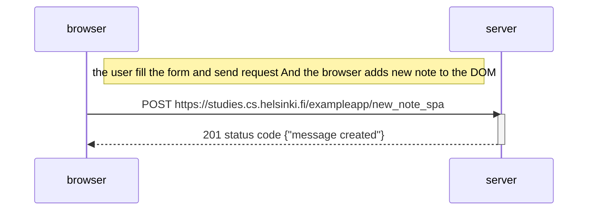

```mermaid
sequenceDiagram
    participant browser
    participant server

    Note right of browser: the user fill the form and send request And the browser adds new note to the DOM
    browser->>server: POST https://studies.cs.helsinki.fi/exampleapp/new_note_spa
    activate server
    server-->>browser: 201 status code {"message created"}
    deactivate server
```
